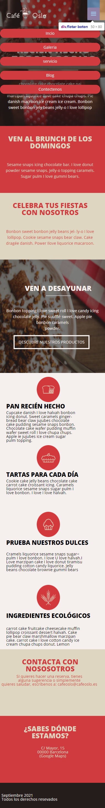
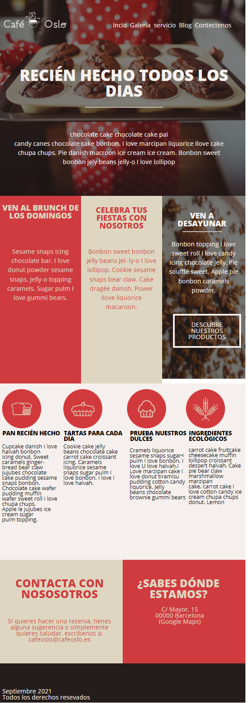
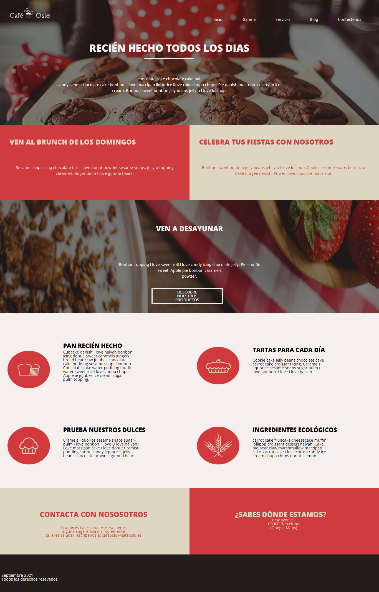

# Portal Cafeteria Oslo 

Este proyecto desarrolla un portal publicitario de un sitio web tipo responsivo, en donde se emplean diferentesestilos y estructuras en CSS. En él se muestradiferentes aplicaciones de propiedades comofloat y positions, herramientas decorativastales como: fondos, sombras, tipografíasentre otras. Y se caracteriza por manejar unanavegación tipo responsiva con la aplicaciónde retículas flexibles y media queries pararesoluciones de Móvil, Tablet y Ordenador,además posee una interacción con javascript.

---
## Oslo Cafe diseño responsivo 

## Movil
En la versión móvil se destaca por tener un menú adaptado al estilo de resolución de la pantalla, cuenta con un manejo de caja flexible en diseño css para tener una mejor adaptación del contenido y se observara la aplicación de media queries.

## Tablet
Para la resolución de pantalla tipo tableta se manejó una diferente distribución en su layout con la implementación de métodos como: flex-box, position, y float. Se adecua un menú diferente para este tipo de tamaño. Y hay una redistribución de imágenes iconos entre otros elementos que conforman este sitio web.

## Ordenador

Para la modelo de pantalla Ordenador se maneja un menú para este tipo de resolución, de nuevo manejamos otra distribución de elementos que se adecuen en los tamaños responsivos.

---
## Lenguajes trabajados

|logo | lenguaje|
|-------|--------|
|   | HTML |
|   | CSS |
|   | Java |
